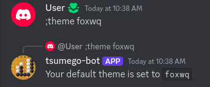
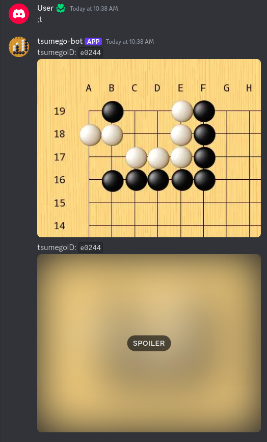
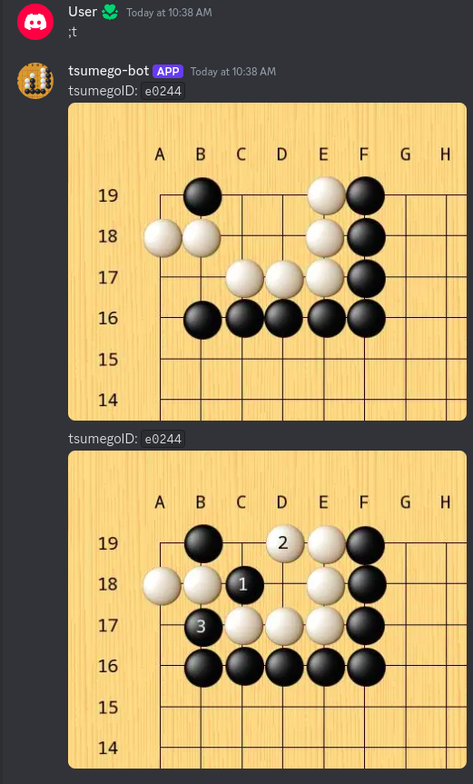

# Discord tsumego-bot


### Tsumego-bot is a Discord bot that will help you improve your tsumego solving skills.

Uses [sgf2image](https://github.com/noword/sgf2image) to generate images.

## Usage
```
Available commands:
    ;tsumego                Show random tsumego. Shortcut ;t

    ;tsumego lvl            Show tsumego at level lvl

    ;level                  Show available levels. Shortcut lvl by using first character

    ;theme                  Show available themes

    ;theme name             Select your theme

    ;randomtheme            Set theme to random

    ;subscribe              Subscribe to get daily tsumego

    ;subscribe lvl          Subscribe to get daily tsumego at level lvl

    ;unsubscribe            Unsubscribe daily tsumego

Example:
    ;t e                    Show elementary tsumego

    ;theme cartoon          Set theme to "cartoon"

    ;subscribe a            Subscribe to daily tsumego at advanced level
```








## Create a new discord application
- Create a new application at https://discord.com/developers/applications
- Generate a token
- Check "Message Content Intent"
- Check "bot" in OAuth2 URL Generator 
- Click on the generated link


## Setup

- Paste your token into config.json 

## Run
`docker build -t tsumego-bot .`

`docker run -d --restart unless-stopped -v </path/to/tsumego-bot>:/data tsumego-bot`

## Have fun
and get stronger!

## License
[MIT](LICENSE)